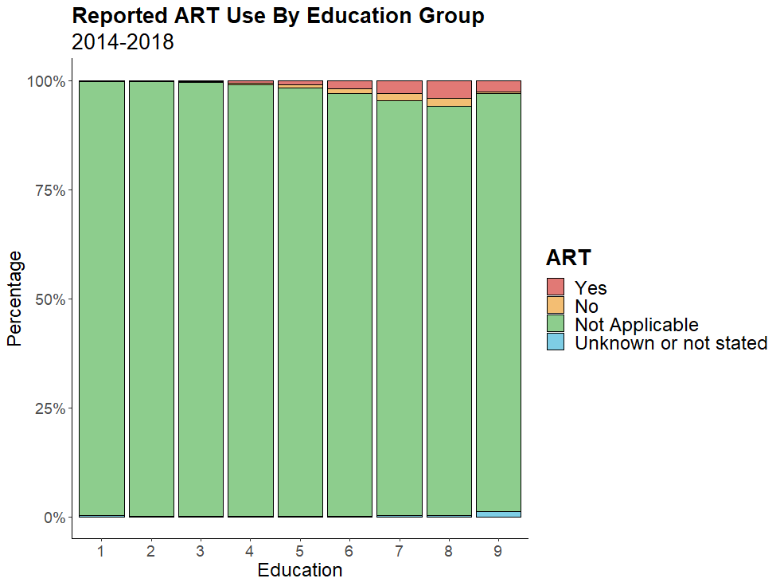

# CDC Births

Data from [CDC Vital Statistics](https://www.cdc.gov/nchs/data_access/vitalstatsonline.htm).

To generate plots, run `sh master_script.sh $1 $2 $3`, where $1 is your start year, $2 is your increment, and $3 is your end year. For instance, if you want data for every year from 1969 to 2019 (these are the limits of the years CDC provides data for), you'd run `sh master_script.sh 1969 1 2019`. This will download, unzip, extract, clean, and plot the data.

## System Dependencies
Your dependencies will vary by operating system. There are some R dependencies you might have to install if you're on Linux. See `dependencies.sh`.

Note that the zipped files are in the 100-250MB range. So, they may take a while to download and unzip. Once unzipped, they are each in the 1-5 GB range. 

## Notes About the Data
**These data are a mess.** Data coding changes year-to-year, there are missing data, and in a couple instances, CDC wrote down the wrong column numbers in their guidebooks.

The real messiness begins in 2003, when states began phasing out the 1989 birth certificate form and phasing in the [new, 2003 form](https://www.cdc.gov/nchs/nvss/revisions-of-the-us-standard-certificates-and-reports.htm). However, adoption happened piecemeal, and it took 11 years for every state to get on board. 

**Because of this, a substantial proportion of education data are missing between 2009 and 2013 (32%, 23%, 14%, 12%, and 10%, respectively).** These levels are much higher than those from 2003-2008, which are consistent with other years (in the 0.1% to 5% range).

The roll-out of the revised form also resulted in some data-coding oddities. For instance, in 2003, when only 2 states had implemented the new form, maternal age was coded in two ways, one of which was $$coded_age = actual_age - 13$$ (but only for ages >= 15). (I assume this was done to harmonize the unrevised and revised forms, but it doesn't make much sense; the following year's coding was normal.)

### Easier ways to access the data
If you don't need data before 1995 and are willing to have maternal age binned (this is the case from 1995-2003) and only have access to a subset of all variables, use the CDC's [data access portal](https://www.cdc.gov/nchs/data_access/vitalstatsonline.htm). 

If, however, you want:
- data going all the way back to 1969
- access to the hundreds of variables included in the birth certificate forms (which you can get by modifying the scripts according to the CDC guidebooks)
- to potentially go crazy trying to figure it all out, 

then you've come to the right place.

### Other data issues

**0. As stated above, education data missingness is bad from 2009 to 2013.** This is only an issue when you want to plot birth _counts_ stratified by education. If you only want to plot education _densities_, then you should be fine to just filter these rows out, assuming the data are missing at random. 

**1. Prior to 2003, education is coded in years, not by level.** The CDC goes so far as to say that education data from the 1989 and 2003 forms aren't comparable, but this seems like throwing the baby out with the bathwater: 

> Many data items (e.g., maternal age, birth order, marital status, attendant at birth, birthweight, gestational age) are common to both the 1989 and 2003 standard birth certificates and are considered directly comparable between revisions. Several key items, however (i.e., educational attainment, tobacco use during pregnancy, month prenatal care began and type of vaginal or cesarean delivery), although collected on both certificate revisions, were substantively modified. Data for these items are not considered comparable between revisions and are not combined in tabulations or in the data files.

To deal with this, I recode the pre-2003 data, mapping it to the 2003 categories.

**2. 1969-1980 are missing varying numbers of births.** Only about half of U.S. births are accounted for in the 1969 data (we know this by comparing against total birth counts from other sources). This missingness decreases throughout the 70's and essentially all births are accounted for from the late 70's onward.

**3. Assisted reproductive therapy data are spotty up until 2014 and still don't capture all IVF births.** Not all states report ART births, though reporting has been ramped up rather quickly—in 2011, 27 states, representing 67% of births, reported; in 2014, 43 states, representing ~90% of birth, reported; in 2019, 48 states did so, representing 96.3% of births. **However, the numbers still don't add up**: when we ground-truth against the CDC's [ART data](https://www.cdc.gov/art/artdata/index.html), which comes from all IVF clinics, we're still missing around half of all IVF births.

You might wonder if these data are missing systematically, but this doesn't seem to be the case: reporting rates don't differ significantly by education group (with the exception of the 1.1% of 2014-2019 births that don't report education level; this group has a much lower rate of ART reporting), and reporting rates are relatively stable across years (for the remaining 98.9% of births, the reporting rates were 89% in 2014-2015 and 96% in 2016-2019). 

Conditional on reporting ART use, there are 4 reporting options: "Yes", "No", "Not Applicable", and "Unknown or not stated". Averaging data across 2014-2018, among all education groups, >95% choose "Not Applicable". There is a strong positive trend with education for reporting "Yes". Importantly, the rates of "Uknown" and "No" don't seem to differ among education groups, so systematic underreporting doesn't seem to be an issue. (Group 9 reported a blank for education, Group 8 is PhD or Professional Degree, Group 7 is Master's, etc.):

I've not yet added the scripts for creating the ART plots. The data extraction script also doesn't extract the ART data. I might add these later.

### More variables to explore

The files contain hundreds more variables than the few we extract. For instance, there are data on:

- city and county of birth (when population >= 100,000, and only for 2004 and earlier)
- birth weight
- source used to pay for delivery
- etc.

So, consider these bash scripts a general framework for interfacing with the CDC data. If you want access to more variables, go into the [user guides](https://www.cdc.gov/nchs/data_access/vitalstatsonline.htm), find the column numbers for the relevant variables, check the raw files to make sure the user guide wasn't incorrect, and then modify the scripts accordingly.

